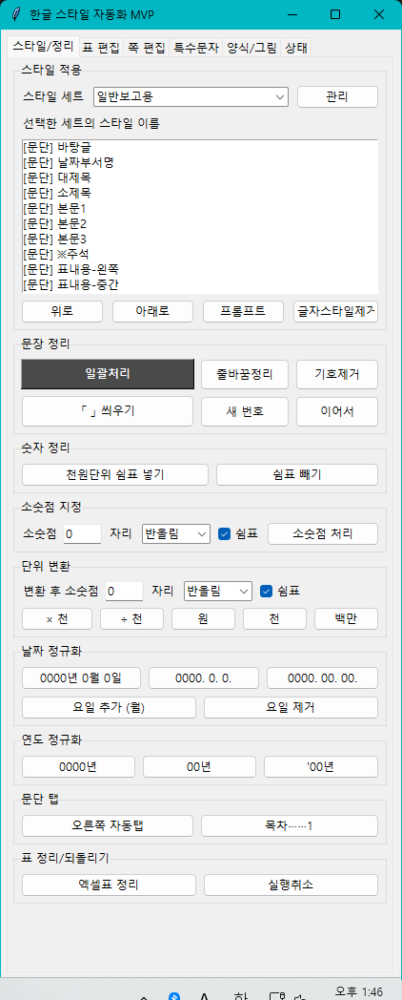

# 4.2 `스타일/정리` 탭

`스타일/정리` 탭에서는 본문을 보고서 양식에 맞게 다듬습니다.

주요 기능은 다음과 같습니다.

| 영역 또는 버튼 | 언제 사용하나요 |
| --- | --- |
| 스타일 세트 | 보고서 양식에 맞는 스타일 묶음을 고릅니다. |
| 스타일 목록 | 선택한 글이나 문단에 같은 이름의 한글 스타일을 적용합니다. |
| `관리` | 스타일 이름, 식별자, 표 체크, 캡션 체크, 규칙을 고칩니다. |
| `프롬프트` | 현재 스타일 세트의 식별자 규칙과 표 작성 규칙을 클립보드에 복사합니다. AI 초안 작성 요청에 사용합니다. |
| `글자스타일제거` | 선택한 글자에 들어간 글자 스타일만 지웁니다. 문단 스타일은 지우지 않습니다. |
| `위로`, `아래로` | 스타일 목록에서 선택한 스타일의 표시 순서를 바꿉니다. 자주 쓰는 스타일을 위쪽에 모아 둘 때 사용합니다. |
| 문단 탭 | 문단 오른쪽 끝에 맞춰 넣을 문구나 목차 점선을 만들 때 사용합니다. |
| `오른쪽 자동탭` | 표 제목 오른쪽에 `(단위: 천원)` 같은 단위 표기를 붙이거나, 제목 줄 오른쪽에 `별첨자료`, `증빙자료` 같은 표시를 붙일 때 사용합니다. |
| `목차 점선` | 목차처럼 왼쪽 제목과 오른쪽 쪽 번호 사이를 점선으로 연결할 때 사용합니다. 예를 들어 `목차……1` 같은 모양을 만들 때 씁니다. |
| `일괄처리` | 식별자와 규칙을 보고 선택한 문단을 한 번에 정리합니다. |
| `줄바꿈정리` | 복사해 온 글의 불필요한 줄바꿈을 줄입니다. |
| `「 」 씌우기` | 선택한 규정명이나 문서명을 낫표 괄호로 감쌉니다. |
| `기호제거` | 문단 앞에 직접 입력한 개요 기호를 지웁니다. |
| `새 번호` | 현재 문단 번호를 새 번호로 시작합니다. |
| `이어서` | 현재 문단 번호를 앞 번호에 이어갑니다. |
| 숫자 정리 | 쉼표, 소숫점, 단위 변환을 처리합니다. |
| 날짜 정규화 | 날짜와 요일 표기를 통일합니다. |
| 연도 정규화 | 연도를 `0000년`, `00년`, `'00년` 형식으로 맞춥니다. |
| `엑셀표 정리` | 엑셀에서 붙여넣은 표를 기본 보고서 표 모양으로 빠르게 정리합니다. |

본문 초안을 정리하기 전에 `관리`에서 스타일 식별자를 확인합니다. 식별자는 문장 앞의 `ㅇ`, `○`, `-`, `표점` 같은 기호나 약속어입니다. 식별자를 맞춘 뒤 전체 문단을 선택하고 `일괄처리`를 누르면 앱이 문장 앞 식별자를 보고 스타일을 적용합니다.

`새 번호`와 `이어서`는 둘 다 번호가 들어간 문단에서 사용합니다. 번호가 없는 일반 문단에서는 실패할 수 있습니다.
