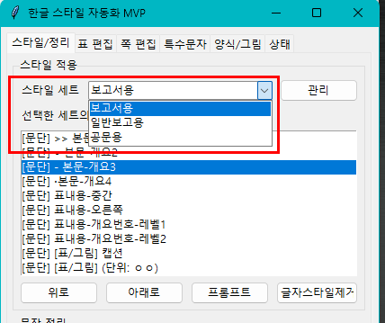

# 6.1 스타일 세트

스타일 세트는 문서 유형별 스타일 묶음입니다. 보고서, 일반보고, 공문처럼 문서 종류가 다르면 쓰는 스타일도 다릅니다. 이때 스타일 세트를 나누면 문서 유형에 맞게 설정을 바꿔 사용할 수 있습니다.

`스타일/정리` 탭에서 스타일 세트를 선택합니다. `관리`를 누르면 세트를 추가하거나 스타일을 바꿀 수 있습니다.

스타일 세트에는 문단 스타일, 글자 스타일, 자동 굵게 규칙이 들어갑니다.
