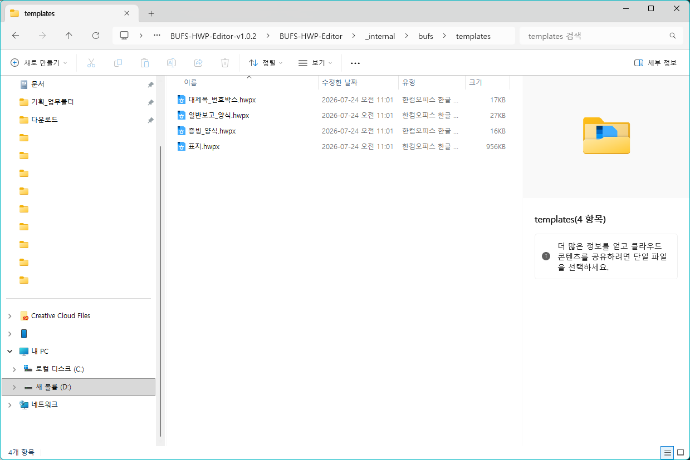

# 13.3 공통 양식 변경

매번 새 문서에 들어가는 기본 스타일과 표지, 보고양식 모양을 바꾸려면 설치 폴더의 `bufs/templates`에 있는 양식 파일을 관리합니다.

다만 일반 사용자가 양식 파일을 직접 열어 작업하면 원본 양식을 잘못 바꿀 수 있습니다. 개인 문서에서 스타일만 가져오려면 한글의 `스타일 불러오기`에서 `bufs/templates`의 양식 파일을 선택합니다. 현재 문서에 보고양식을 넣고 싶다면 앱의 `양식/그림` 탭에서 `보고양식 불러오기`를 누릅니다.

양식 파일 자체를 바꿀 때는 자리표시자와 파일 위치를 함께 확인해야 합니다. 자세한 주의 사항은 `16.3 로고와 템플릿 관리`를 참고합니다.
