# BUFS 한글 편집기 사용설명서 초안

부제: 보고서 양식 정리와 스타일 커스터마이징 가이드

## 1. 빠른 시작

BUFS 한글 편집기는 한글 보고서를 작성할 때 반복해서 손보는 서식을 빠르게 맞추는 도구입니다. 본문 스타일을 적용하고 표 모양을 정리하며 숫자와 날짜 형식을 통일할 수 있습니다. 표지와 보고양식을 불러오고 로고도 넣을 수 있습니다.

처음 사용할 때는 다음 순서로 시작합니다.

1. 한글에서 편집할 문서를 엽니다.
2. `BUFS-HWP-Editor.exe`를 실행합니다.
3. 앱의 `상태` 탭에서 대상 문서를 확인합니다.
4. 한글 문서에서 바꿀 문단이나 표를 선택합니다.
5. 앱에서 필요한 버튼을 누릅니다.
6. 결과가 맞지 않으면 한글의 `Ctrl+Z` 또는 앱의 실행취소를 누릅니다.

앱은 사용자가 한글에서 선택한 문단이나 표를 기준으로 움직입니다. 문서 전체를 마음대로 바꾸지 않습니다. 다만 표지 삽입이나 로고 삽입처럼 새 내용을 넣는 기능은 현재 커서 위치를 기준으로 합니다.

중요한 문서는 작업 전에 저장해 두는 편이 좋습니다. 처음 쓰는 기능은 복사본에서 먼저 시험해 보십시오.

## 2. 사용 전 준비

앱을 사용하려면 Windows PC와 한컴오피스 한글이 필요합니다. 배포받은 실행 파일을 쓰는 경우 Python은 설치하지 않아도 됩니다.

기본 준비물은 다음과 같습니다.

- Windows PC
- 한컴오피스 한글 2024 또는 호환 버전
- 배포받은 `BUFS-HWP-Editor` 폴더
- 편집할 한글 문서

한글 문서를 먼저 열고 앱을 실행해야 합니다. 앱을 먼저 실행했거나 한글 문서가 열려 있지 않으면 앱이 대상 문서를 찾지 못할 수 있습니다. 이때는 문서를 연 뒤 `상태` 탭에서 `한글 다시 연결`을 누릅니다.

문서는 가능하면 `.hwpx` 형식으로 저장한 뒤 작업합니다. `.hwp` 형식 문서도 한글에서 열 수 있지만 스타일 목록 확인이나 이름 매칭이 불안정할 수 있습니다. 스타일 적용이 잘 되지 않으면 먼저 `.hwpx`로 다른 이름 저장한 뒤 다시 연결해 시험합니다.

## 3. 기본 사용 원칙

### 3.1 대상 문서 확인

한글 창을 여러 개 열어 두면 앱이 사용자가 생각한 문서가 아닌 다른 문서에 연결될 수 있습니다. 작업을 시작하기 전에 `상태` 탭에서 대상 문서를 확인합니다.

대상 문서가 다르면 원하는 한글 창을 앞으로 가져온 뒤 다시 연결합니다.

### 3.2 선택 영역 기준

본문 정리, 숫자 정리, 날짜 정리, 스타일 적용은 보통 한글에서 선택한 영역에 적용됩니다.

예를 들어 본문 세 문단을 선택하고 `일괄처리`를 누르면 선택한 세 문단만 정리됩니다. 선택하지 않은 문단은 그대로 남습니다.

### 3.3 표 선택 상태

표 편집 기능은 표 안에 커서를 두거나 표 셀을 선택해야 잘 동작합니다. 표 밖에 커서가 있으면 앱이 어떤 표를 바꿔야 하는지 알기 어렵습니다.

표 전체를 바꾸려면 표 안에 커서를 두고 기능을 실행하거나 표 전체 셀을 선택합니다. 일부 셀만 바꾸려면 해당 셀만 선택합니다.

### 3.4 스타일 이름 일치

앱은 현재 한글 문서에 들어 있는 스타일 이름을 찾아 적용합니다. 앱 설정에 `본문1`이 있어도 현재 문서에 `본문1` 스타일이 없으면 적용되지 않을 수 있습니다.

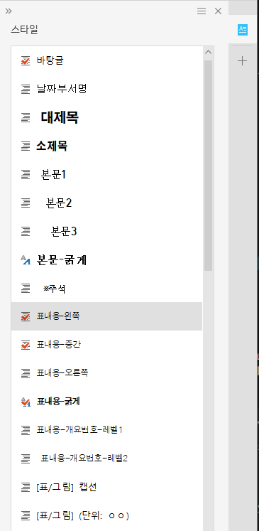

*한글 문서에 실제로 들어 있는 스타일 이름을 확인합니다.*

보고서 양식을 직접 바꿔 쓰는 경우에는 한글 문서의 스타일 이름과 앱의 스타일 세트에 등록한 이름을 맞춰야 합니다.

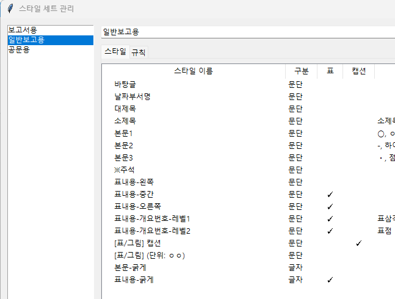

*앱 스타일 목록의 이름과 한글 문서의 스타일 이름을 맞춥니다.*

스타일 이름을 맞추는 방법은 두 가지입니다. 한글의 스타일 불러오기에서 설치 폴더의 `bufs/templates`에 있는 양식 파일을 선택해 스타일을 가져올 수 있습니다. 또는 현재 작업 중인 파일에서 `양식/그림` 탭의 보고양식 불러오기 버튼을 눌러 보고양식을 현재 문서에 넣을 수 있습니다.

양식 파일을 직접 열어서 작업하지 않는 편이 안전합니다. 원본 양식을 잘못 편집할 수 있기 때문입니다.

한글에서 스타일을 직접 추가하거나 고칠 수도 있습니다. 자세한 방법은 한글 2024 도움말을 참고합니다.

- [스타일 추가하기](https://help.hancom.com/hoffice130_assistant/ko-KR/Hwp/index.htm#t=format%2Fstyle%2Fstyle(new).htm)
- [스타일 편집하기](https://help.hancom.com/hoffice130_assistant/ko-KR/Hwp/index.htm#t=format%2Fstyle%2Fstyle(edit).htm)
- [스타일 적용하기](https://help.hancom.com/hoffice130_assistant/ko-KR/Hwp/index.htm#t=format%2Fstyle%2Fstyle(apply).htm)

한글에서 스타일을 새로 만들었거나 다른 문서에서 스타일을 가져온 뒤에도 적용되지 않으면 `상태` 탭에서 `한글 다시 연결`을 누릅니다. 다시 연결한 뒤 대상 문서가 맞는지 확인하고 같은 스타일을 다시 적용합니다.

### 3.5 실행취소

앱에서 적용한 대부분의 편집은 한글의 실행취소로 되돌릴 수 있습니다. 결과가 이상하면 바로 `Ctrl+Z`를 누릅니다. 여러 작업을 한 뒤에는 어느 단계까지 되돌아갈지 헷갈릴 수 있으므로 큰 작업 전에는 문서를 저장해 둡니다.

## 4. 화면 구성

### 4.1 `상태` 탭

`상태` 탭에서는 한글 연결 상태와 대상 문서를 확인합니다. 앱이 의도한 문서에 연결되었는지 확인할 때 가장 먼저 봅니다.

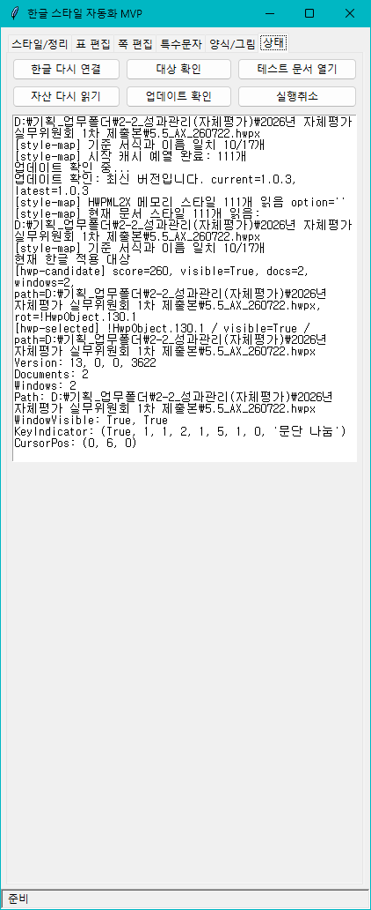

주요 기능은 다음과 같습니다.

| 버튼 또는 영역 | 언제 사용하나요 |
| --- | --- |
| `한글 다시 연결` | 현재 열려 있는 한글 문서를 다시 찾습니다. 한글에서 문서를 새로 열었거나 스타일을 불러온 뒤 앱이 변화를 못 알아보면 누릅니다. |
| `대상 확인` | 앱이 어느 한글 문서에 연결되어 있는지 확인합니다. 한글 창을 여러 개 열어 둔 상태에서 먼저 확인합니다. |
| `테스트 문서 열기` | 앱에 들어 있는 서식 테스트용 문서 복사본을 엽니다. 실제 보고서를 건드리기 전에 버튼 동작을 시험할 때 사용합니다. |
| `자산 다시 읽기` | 로고, 템플릿, 스타일 세트 같은 앱 파일을 다시 읽습니다. 로고 파일이나 양식 파일을 바꾼 직후에 사용합니다. |
| `업데이트 확인` | 새 버전이 있는지 확인합니다. |
| `실행취소` | 한글의 실행취소를 실행합니다. 결과가 이상하면 바로 사용합니다. |
| 로그 영역 | 어떤 버튼을 눌렀는지, 어떤 스타일을 찾았는지, 한글에서 어떤 작업이 실패했는지 확인합니다. |

오류가 나면 로그 영역을 확인합니다. 로그에는 어떤 버튼을 눌렀는지, 어떤 스타일을 찾았는지, 한글에서 어떤 작업이 실패했는지가 남습니다.

### 4.2 `스타일/정리` 탭

`스타일/정리` 탭에서는 본문을 보고서 양식에 맞게 다듬습니다.


주요 기능은 다음과 같습니다.

| 영역 또는 버튼 | 언제 사용하나요 |
| --- | --- |
| 스타일 세트 | 보고서 양식에 맞는 스타일 묶음을 고릅니다. |
| 스타일 목록 | 선택한 글이나 문단에 같은 이름의 한글 스타일을 적용합니다. |
| `관리` | 스타일 이름, 식별자, 표 체크, 캡션 체크, 규칙을 고칩니다. |
| `프롬프트` | 현재 스타일 세트의 식별자 규칙과 표 작성 규칙을 클립보드에 복사합니다. AI 초안 작성 요청에 사용합니다. |
| `글자스타일제거` | 선택한 글자에 들어간 글자 스타일만 지웁니다. 문단 스타일은 지우지 않습니다. |
| `일괄처리` | 식별자와 규칙을 보고 선택한 문단을 한 번에 정리합니다. |
| `줄바꿈정리` | 복사해 온 글의 불필요한 줄바꿈을 줄입니다. |
| `「 」 씌우기` | 선택한 규정명이나 문서명을 낫표 괄호로 감쌉니다. |
| `기호제거` | 문단 앞에 직접 입력한 개요 기호를 지웁니다. |
| `새 번호` | 현재 문단 번호를 새 번호로 시작합니다. |
| `이어서` | 현재 문단 번호를 앞 번호에 이어갑니다. |
| 숫자 정리 | 쉼표, 소숫점, 단위 변환을 처리합니다. |
| 날짜 정규화 | 날짜와 요일 표기를 통일합니다. |

본문 초안을 정리하기 전에 `관리`에서 스타일 식별자를 확인합니다. 식별자는 문장 앞의 `ㅇ`, `○`, `-`, `표점` 같은 기호나 약속어입니다. 식별자를 맞춘 뒤 전체 문단을 선택하고 `일괄처리`를 누르면 앱이 문장 앞 식별자를 보고 스타일을 적용합니다.

`새 번호`와 `이어서`는 둘 다 번호가 들어간 문단에서 사용합니다. 번호가 없는 일반 문단에서는 실패할 수 있습니다.

### 4.3 `표 편집` 탭

`표 편집` 탭에서는 표의 색상, 선, 여백, 제목셀, 캡션을 정리합니다.

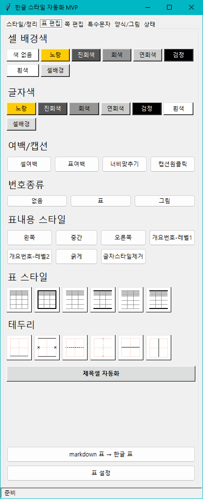

주요 기능은 다음과 같습니다.

- 셀 배경색 적용
- 글자색 적용
- 표내용 스타일 적용
- 표 선 프리셋 적용
- 제목셀 자동화
- 셀여백
- 표여백
- 너비맞추기
- 캡션원클릭
- 마크다운 표를 한글 표로 변환
- 표 설정

표 기능은 선택 상태에 따라 결과가 달라집니다. 셀 일부를 선택하면 선택한 셀에 적용됩니다. 표 안에 커서만 두면 현재 표를 기준으로 적용하려고 시도합니다.

### 4.4 `쪽 편집` 탭

`쪽 편집` 탭에서는 머리말, 꼬리말, 쪽번호를 감추고, 새 번호 개체나 머리말 개체를 넣습니다.

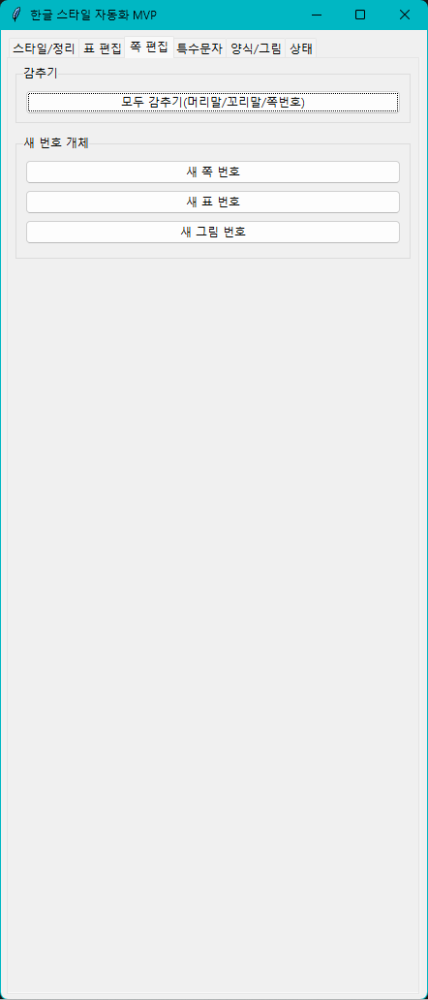

`새 번호 개체` 그룹은 `새 쪽 번호`, `새 표 번호`, `새 그림 번호`를 넣을 때 사용합니다. 번호를 넣을 위치에 커서를 둔 뒤 실행합니다.

`머리말 개체` 그룹은 `머리말 양쪽`, `머리말 짝수쪽`, `머리말 홀수쪽` 버튼으로 구성됩니다. 본문 쪽에 커서를 둔 상태에서 실행하면 해당 쪽 유형의 머리말 영역을 바로 만들 수 있습니다.

### 4.5 `특수문자` 탭

`특수문자` 탭에서는 글자 겹치기와 체크박스 문자를 넣습니다. 자주 쓰는 특수문자를 등록해 둘 수도 있습니다.

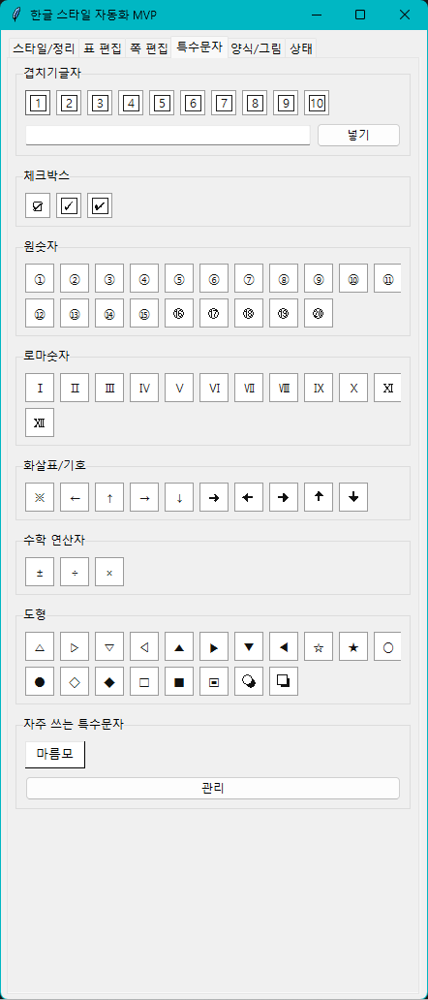

체크박스는 문서 안에 체크 표시를 넣을 때 사용합니다. 입력할 위치에 커서를 둔 뒤 원하는 체크박스를 누릅니다.

### 4.6 `양식/그림` 탭

`양식/그림` 탭에서는 표지, 보고양식, 증빙 PDF, 그림, 로고를 다룹니다.

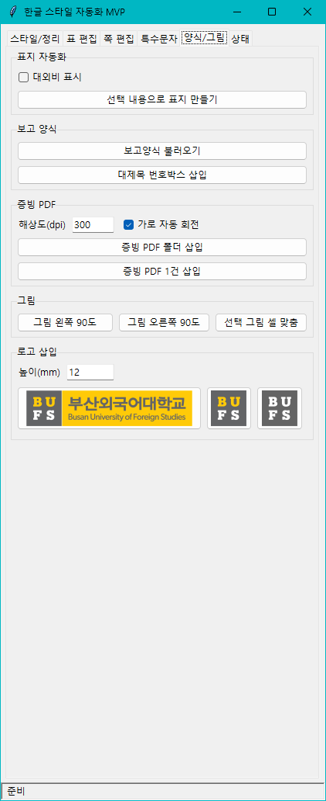

주요 기능은 다음과 같습니다.

| 영역 또는 버튼 | 언제 사용하나요 |
| --- | --- |
| 선택 내용으로 표지 만들기 | 제목, 날짜, 부서명을 선택해 표지를 만듭니다. |
| 보고양식 불러오기 | 현재 문서에 보고서 기본 양식을 넣습니다. |
| 대제목 번호박스 삽입 | 큰 제목 앞에 번호가 들어간 상자를 넣습니다. |
| 증빙 PDF 폴더 삽입 | 폴더 안의 PDF 파일을 이름순으로 증빙 양식에 넣습니다. |
| 증빙 PDF 1건 삽입 | PDF 파일 하나를 증빙 양식에 넣습니다. |
| 그림 왼쪽 90도 | 선택한 그림을 왼쪽으로 돌립니다. |
| 그림 오른쪽 90도 | 선택한 그림을 오른쪽으로 돌립니다. |
| 선택 그림 셀 맞춤 | 선택한 그림을 현재 표 셀 크기에 맞춥니다. |
| 로고 삽입 | 로고 칩을 눌러 현재 커서 위치에 로고를 넣습니다. |

제목, 날짜, 부서명을 한글에서 선택한 뒤 표지 만들기나 보고양식 불러오기를 실행합니다. 로고는 현재 커서 위치에 들어갑니다. 증빙 PDF와 그림 기능은 증빙 자료를 보고서 뒤쪽에 붙일 때 사용합니다.

## 5. 보고서 작성 흐름

### 5.1 새 보고서 시작

빈 문서에서 시작한다면 `양식/그림` 탭에서 보고양식을 불러옵니다. 제목, 날짜, 부서명을 미리 적어 두고 선택하면 앱이 양식의 자리표시자를 채웁니다.


예시는 다음과 같습니다.

```text
제목: 2026학년도 대학혁신지원사업 자체점검 결과 보고
부서: 대학성과분석센터
날짜: 오늘
```

날짜를 쓰지 않으면 앱이 기본 날짜를 넣습니다. `오늘` 또는 `{{오늘}}`이라고 쓰면 현재 날짜를 넣습니다.

### 5.2 스타일 식별자 설정

`일괄처리`를 제대로 쓰려면 먼저 앱에 “어떤 문장 앞 기호를 어떤 스타일로 바꿀지” 알려 주어야 합니다. 이 설정은 `스타일/정리` 탭의 `관리`에서 합니다.

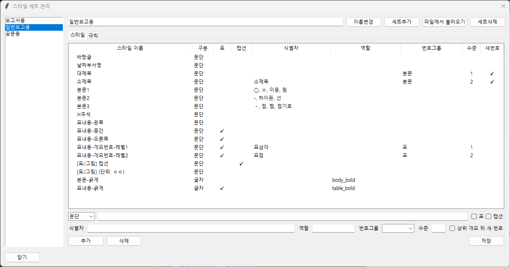

예를 들어 보고서 본문에서 `ㅇ`으로 시작하는 문장을 `◦ 본문-개요2` 스타일로 바꾸고 싶다면 `◦ 본문-개요2` 스타일의 식별자에 `ㅇ`을 넣습니다.

기본 순서는 다음과 같습니다.

1. `스타일/정리` 탭을 엽니다.
2. 사용할 스타일 세트를 고릅니다.
3. `관리`를 누릅니다.
4. 일괄처리에 사용할 문단 스타일을 선택합니다.
5. 식별자 또는 개요 표시자에 문장 앞 기호를 넣습니다.
6. 표 안에서 쓸 스타일이면 `표`를 체크합니다.
7. 캡션에 쓸 스타일이면 `캡션`을 체크합니다.
8. 자동 굵게에 쓸 스타일이면 종류를 `글자`로 두고 역할을 확인합니다.
9. 번호를 다룰 스타일이면 그룹, 단계, 새 번호 설정을 확인합니다.
10. 저장한 뒤 복사본 문서에서 `일괄처리`를 시험합니다.

식별자는 여러 개 넣을 수 있습니다. 같은 스타일을 `ㅇ`, `○`, `원기호`에 모두 적용하고 싶다면 해당 스타일의 식별자 목록에 함께 넣습니다.

표 안에서 쓰는 식별자는 본문 식별자와 따로 생각하는 편이 좋습니다. 예를 들어 본문에서는 `-`를 본문 하위 항목으로 쓰고 표 안에서는 `-`를 표 안 하위 항목으로 쓸 수 있습니다. 이때 표 안 스타일에는 `표`를 체크하고 그룹을 `table`로 둡니다.

AI로 본문 초안을 받을 때는 `스타일/정리` 탭의 `프롬프트` 버튼을 눌러 현재 스타일 세트 기준 작성 규칙을 클립보드에 복사한 뒤, ChatGPT 같은 도구에 함께 넣습니다. 이 프롬프트에는 `대제목`, `소제목`, `원`, `선`, `점` 같은 식별자 규칙과 Markdown 표 작성 규칙이 들어 있습니다.

### 5.3 AI 초안 + 일괄처리

AI 초안을 받을 때는 아래 순서가 가장 안정적입니다.

1. `관리`에서 현재 스타일 세트의 식별자와 번호 규칙을 먼저 점검합니다.
2. `프롬프트` 버튼으로 작성 규칙을 복사합니다.
3. AI에 보고서 초안 작성을 요청할 때 프롬프트를 함께 넣습니다.
4. 받은 결과를 한글 문서에 붙여넣습니다.
5. 필요한 범위를 선택하고 `일괄처리`를 실행합니다.


표가 필요한 경우에는 AI가 표를 Markdown pipe table 형식으로 내보내도록 요청해야 합니다. 셀 안 줄바꿈이 필요하면 `<br>`를 쓰게 하는 편이 좋습니다. 붙여넣는 과정에서 탭 구분 표로 바뀌었다면 다시 코드블록 안 Markdown 표 형태로 복사해 오는 것이 안전합니다.

AI가 직접 `가.`, `1.`, `-`, `•` 같은 실제 번호나 기호를 쓰면 앱의 번호 체계와 충돌할 수 있습니다. AI에게는 번호를 쓰지 말고 식별자만 붙이라고 요청하는 편이 좋습니다.

### 5.4 본문 초안 일괄처리

보고서를 작성할 때 처음부터 특수문자와 한글 스타일을 모두 맞추려 하면 손이 많이 갑니다. 먼저 `ㅇ`, `-`, `표점`, `(배경)`, `목적:` 같은 쉬운 텍스트로 초안을 씁니다. 또는 개요 기호가 서로 다른 본문을 가져온 뒤 문장 앞 기호만 정리합니다. 그다음 정리할 범위를 선택하고 `스타일/정리` 탭의 `일괄처리`를 누릅니다.


일괄처리는 다음 일을 함께 합니다.

- 문장 앞 기호를 보고 문단 스타일을 적용합니다.
- `(배경)`처럼 문장 앞 괄호 키워드를 굵게 만듭니다.
- `목적:`처럼 콜론 앞 키워드를 굵게 만듭니다.
- `**중요 내용**`처럼 마크다운 굵게 표시가 있으면 별표를 지우고 글자 스타일을 적용합니다.
- 표 안 텍스트에는 표용 스타일을 적용합니다.

예시는 다음과 같습니다.

```text
ㅇ (배경) 외국인전임교원이 국내정착을 지원하기 위하여 매월 주거보조비를 지급하고 있음.
목적: 신임교원의 조기 적응과 안정적인 교육활동을 지원하고자 함.
- 세부 계획: 부서별 담당자를 지정하고 월별 점검표를 작성함.
```

### 5.5 숫자와 날짜 정리

보고서에서는 숫자와 날짜 형식이 섞이기 쉽습니다. 필요한 문장을 선택한 뒤 숫자 정리나 날짜 정규화 버튼을 누릅니다.

자주 쓰는 기능은 다음과 같습니다.

| 버튼 또는 영역 | 바뀌는 내용 |
| --- | --- |
| `천원단위 쉼표 넣기` | 선택한 숫자에 천 단위 쉼표를 넣습니다. |
| `쉼표 빼기` | 숫자 안의 천 단위 쉼표를 뺍니다. |
| `소숫점 처리` | 지정한 자리수로 반올림, 올림, 버림 처리합니다. |
| `× 천` | 숫자에 1,000을 곱합니다. 단위가 있으면 함께 바꾸려고 합니다. |
| `÷ 천` | 숫자를 1,000으로 나눕니다. 단위가 있으면 함께 바꾸려고 합니다. |
| `원`, `천`, `백만` | 선택한 숫자를 해당 단위로 바꿉니다. |
| `0000년 0월 0일` | 날짜를 한글식 날짜로 맞춥니다. |
| `0000. 0. 0.` | 날짜를 점 표기 날짜로 맞춥니다. |
| `0000. 00. 00.` | 월과 일을 두 자리 점 표기로 맞춥니다. |
| `요일 추가 (월)` | 날짜 뒤에 요일을 붙입니다. |
| `요일 제거` | 날짜 뒤 요일을 지웁니다. |
| 연도 정규화 | 연도를 `0000년`, `00년`, `'00년` 형식으로 맞춥니다. |

숫자 정리는 날짜, 전화번호, 학년도 같은 표현을 무리하게 바꾸지 않도록 보수적으로 동작합니다. 그래도 결과를 확인한 뒤 저장합니다.

`소숫점 처리`는 선택한 숫자를 지정한 자리수로 반올림, 올림, 버림 처리합니다. 앱 화면에는 `소숫점`이라고 표시되어 있지만 의미는 소수점 자리입니다. 쉼표를 체크하면 결과에 천 단위 쉼표를 함께 넣습니다.

단위 변환은 선택한 숫자와 단위를 함께 보고 바꿉니다. 예를 들어 `1백만원`을 `천`으로 바꾸면 `1,000천원`처럼 바꿀 수 있습니다. 선택한 내용에 변환 대상이 아닌 단위가 섞여 있으면 앱이 중단할 수 있습니다.

표 셀 여러 칸을 한꺼번에 선택한 숫자 블록은 한글 붙여넣기 과정에서 셀 내용이 흐트러질 수 있습니다. 앱이 위험하다고 판단하면 변환을 중단합니다. 이때는 한 셀 안의 텍스트만 선택하거나 셀 범위를 다시 블록 선택한 뒤 시험합니다.

### 5.6 표 정리

표 안에 커서를 두거나 셀을 선택한 뒤 `표 편집` 탭의 기능을 사용합니다.

표 전체를 기본 모양으로 맞추려면 `표 스타일` 아이콘 버튼을 사용합니다. 표 스타일 버튼은 표 전체 선을 맞추고 첫 줄을 제목셀처럼 정리합니다.


일부 셀만 바꾸려면 해당 셀을 선택한 뒤 배경색이나 글자색을 누릅니다. 표 안 글자 정렬이나 문단 모양을 바꾸려면 `표내용-왼쪽`, `표내용-중간`, `표내용-오른쪽` 같은 표내용 스타일을 사용합니다.

`표 편집` 탭에 보이는 표내용 스타일 버튼은 `스타일/정리` 탭의 `관리`에서 `표`가 체크된 문단 스타일을 기준으로 나타납니다. 원하는 표 스타일이 보이지 않으면 해당 스타일을 스타일 세트에 넣고 `표`를 체크합니다.

### 5.7 캡션 만들기

표 위에 다음과 같은 문장을 미리 써 둡니다.

```text
[표 5.4-8] 샘플표제통
```

문장을 선택한 뒤 `표 편집` 탭의 `캡션원클릭`을 누릅니다. 앱은 문장을 읽고 근처 표를 찾아 캡션을 만듭니다. 캡션 스타일로 지정한 스타일도 함께 적용합니다.


그림 캡션도 다음처럼 쓸 수 있습니다.

```text
[그림 2.4-1] 학사관리 체계 개선 실적
```

캡션이 만들어지지 않으면 문장 형식이 맞는지, 근처에 표가 있는지, 캡션 체크된 스타일이 있는지 확인합니다.

캡션원클릭은 표 캡션을 만들 때 표 번호 개체를 함께 넣습니다. 문서 안에 번호를 매기면 안 되는 보조 표가 있으면 뒤쪽 표 번호가 밀릴 수 있습니다. 이때는 보조 표를 선택한 뒤 `표 편집` 탭의 `번호종류`에서 `없음`을 누릅니다.

### 5.8 마크다운 표 변환

마크다운 표를 선택한 뒤 `markdown 표 → 한글 표`를 누릅니다. 표 머리글, 구분선, 마지막 행까지 함께 선택해야 합니다.

예시는 다음과 같습니다.

```text
| 구분 | 내용 |
| --- | --- |
| A | 첫 번째 내용 |
| B | 두 번째 내용 |
```

앱은 선택한 텍스트를 한글 표로 붙여넣고 기본 표 서식을 적용합니다. 이때 한글에서 붙여넣기 선택 창이 뜨면 반드시 `원본 형식 유지`를 선택합니다. 한글 버전에 따라 `원본` 또는 `원본 형식`으로 보일 수 있습니다. 다른 옵션을 고르면 표가 일반 텍스트로 들어가거나 셀 구조가 흐트러질 수 있습니다.


변환 뒤에는 표 선, 셀여백, 표여백, 너비를 확인합니다.

## 6. 스타일 설정

### 6.1 스타일 세트

스타일 세트는 문서 유형별 스타일 묶음입니다. 보고서, 일반보고, 공문처럼 문서 종류가 다르면 쓰는 스타일도 다릅니다. 이때 스타일 세트를 나누면 문서 유형에 맞게 설정을 바꿔 사용할 수 있습니다.

`스타일/정리` 탭에서 스타일 세트를 선택합니다. `관리`를 누르면 세트를 추가하거나 스타일을 바꿀 수 있습니다.

스타일 세트에는 문단 스타일, 글자 스타일, 자동 굵게 규칙이 들어갑니다.

### 6.2 문단 스타일

문단 스타일은 한 문단 전체에 적용하는 서식입니다. 보고서의 제목, 본문, 표 안 내용, 캡션처럼 문단 단위로 모양을 맞출 때 씁니다.

예시는 다음과 같습니다.

- `바탕글`
- `본문1`
- `본문2`
- `표내용-중간`
- `[표/그림] 캡션`

앱은 문단 스타일 이름을 보고 현재 문서의 같은 이름 스타일을 찾아 적용합니다.

### 6.3 글자 스타일

글자 스타일은 선택한 글자 일부에만 적용하는 서식입니다. 문장 전체가 아니라 특정 낱말만 굵게 만들 때 씁니다.

예시는 다음과 같습니다.

- `본문-굵게`
- `표내용-굵게`

자동 굵게 규칙은 글자 스타일을 사용합니다. 예를 들어 `목적: 내용`에서 `목적`만 굵게 만들 때 글자 스타일을 적용합니다.

### 6.4 표 체크

스타일 세트 관리 화면의 `표` 체크박스는 이 스타일이 표 안에서 쓰는 스타일임을 표시합니다.

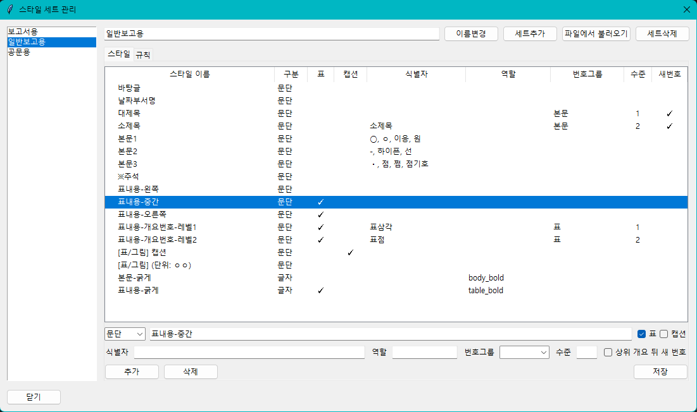

표 안 텍스트는 본문과 줄 간격이나 글자 크기가 다를 수 있습니다. 그래서 표 안에서는 `본문-굵게`가 아니라 `표내용-굵게`처럼 표용 스타일을 쓰는 편이 좋습니다.

다음 스타일에는 보통 `표`를 체크합니다.

- `표내용-왼쪽`
- `표내용-중간`
- `표내용-오른쪽`
- `표내용-개요번호-레벨1`
- `표내용-개요번호-레벨2`
- `표내용-굵게`

표 안 일괄처리가 원하는 스타일을 적용하지 못하면 먼저 `표` 체크를 확인합니다.

`표 편집` 탭의 표내용 스타일 버튼도 `표`가 체크된 문단 스타일을 기준으로 만들어집니다. 표 안에서 쓸 스타일을 새로 만들었는데 버튼에 보이지 않으면 이 체크가 빠졌을 가능성이 큽니다.

### 6.5 캡션 체크

`캡션` 체크박스는 이 스타일이 표나 그림의 캡션에 쓰는 스타일임을 표시합니다.

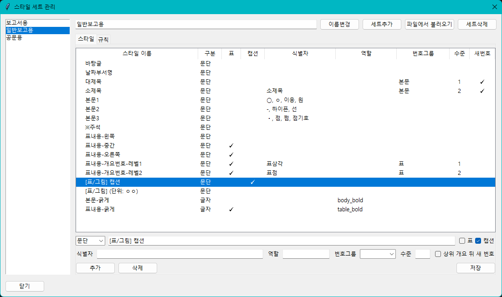

`캡션원클릭`은 캡션을 만든 뒤 캡션용 스타일을 찾아 적용합니다. 이때 캡션 체크된 스타일을 사용합니다.

예를 들어 `[표/그림] 캡션` 스타일을 캡션으로 쓰고 싶다면 스타일 세트 관리 화면에서 해당 스타일에 `캡션`을 체크합니다.

### 6.6 식별자 또는 개요 표시자

식별자 또는 개요 표시자는 문장 맨 앞에 적는 기호나 약속어입니다. 앱은 이 값을 보고 어떤 문단 스타일을 적용할지 판단합니다.

예시는 다음과 같습니다.

- `ㅇ`
- `○`
- `-`
- `∙`
- `표점`
- `표삼각`

예를 들어 `ㅇ`으로 시작하는 문장에 `◦ 본문-개요2` 스타일을 적용하고 싶다면 해당 스타일의 식별자에 `ㅇ`을 등록합니다.

우리 부서에서 `ㅇ` 대신 `○`를 쓴다면 식별자에 `○`를 추가합니다.

### 6.7 역할

역할은 앱이 특정 기능에 쓸 스타일을 찾기 위한 이름표입니다.

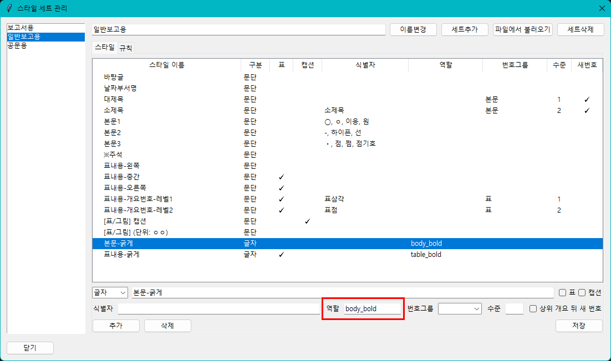

글자 스타일 이름은 문서마다 다를 수 있습니다. 그래서 앱은 이름만 보지 않고 역할도 봅니다. 기본 글자 역할은 다음 두 가지입니다.

- `body_bold`: 본문에서 사용할 굵게 글자 스타일
- `table_bold`: 표 안에서 사용할 굵게 글자 스타일

예를 들어 `본문-굵게` 스타일에는 `body_bold` 역할을 넣습니다. `표내용-굵게` 스타일에는 `table_bold` 역할을 넣습니다.

역할은 문단 스타일이 아니라 글자 스타일에 넣어야 합니다. 스타일 세트 관리 화면에서 스타일 종류가 `문단`으로 되어 있으면 자동 굵게에 쓸 수 없습니다. 자동 굵게에 쓸 스타일은 `글자`로 추가하거나 수정한 뒤 역할에 `body_bold` 또는 `table_bold`를 넣습니다.

스타일 세트 관리 화면의 `규칙` 탭도 함께 확인해야 합니다. 각 규칙에는 적용할 글자 역할이 들어 있습니다. 예를 들어 본문 괄호 키워드 규칙이 `body_bold`를 쓰도록 되어 있다면 `body_bold` 역할을 가진 글자 스타일이 같은 스타일 세트 안에 있어야 합니다. 표 안 규칙이 `table_bold`를 쓰도록 되어 있다면 `table_bold` 역할을 가진 글자 스타일이 필요합니다.

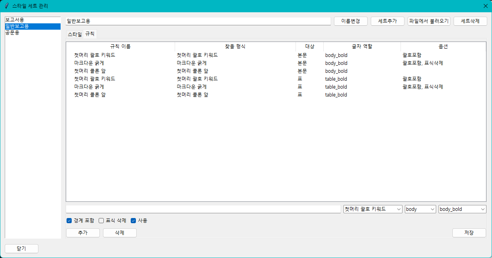

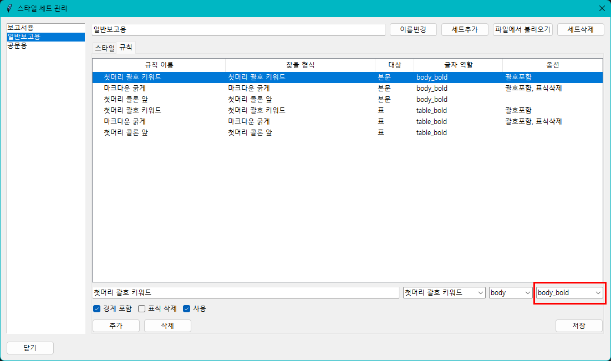

사용 중인 설정에서 `text_bold` 같은 다른 역할 이름을 쓰기로 했다면 글자 스타일의 역할과 `규칙` 탭의 글자 역할을 같은 이름으로 맞춥니다. 두 이름이 다르면 자동 굵게가 적용되지 않습니다.

문단 역할도 하나 있습니다.

- `title_number_box`: 대제목 문단을 번호박스 표로 바꿀 때 쓰는 역할

일반보고용처럼 대제목을 표 모양 번호박스로 넣고 싶다면 `대제목` 문단 스타일에 `title_number_box` 역할을 둡니다. 이 역할이 있는 스타일은 일괄처리 중 일반 문단 스타일 적용 대신 번호박스 양식 삽입으로 처리됩니다.

번호박스 양식 파일은 스타일 세트마다 따로 둘 수 있고, 같은 스타일 세트 안에서도 `title_number_box` 역할을 쓰는 문단 스타일마다 별도 템플릿을 둘 수 있습니다. 세트 위쪽의 템플릿 칸은 기본값이고, 각 스타일의 템플릿 칸을 비워 두면 그 기본값을 따라갑니다.

바꾸는 순서는 다음과 같습니다.

1. `스타일/정리` 탭에서 사용할 스타일 세트를 고릅니다.
2. `관리`를 눌러 스타일 세트 관리 창을 엽니다.
3. `대제목`에 해당하는 문단 스타일의 역할이 `title_number_box`인지 확인합니다.
4. 창 위쪽의 `기본 title_number_box 템플릿` 칸에서 공통 기본 양식을 지정하고 `적용`을 누릅니다.
5. 특정 대제목 스타일만 다른 양식을 쓰려면, 그 스타일을 선택한 뒤 아래의 `이 스타일 번호박스 템플릿` 칸에서 별도 파일을 고르고 `저장`합니다.
6. 복사본 문서에서 `대제목 번호박스 삽입` 또는 `일괄처리`로 시험합니다.

같은 앱이라도 스타일 세트가 다르면 번호박스 템플릿도 다를 수 있습니다. 예를 들어 `일반보고용`은 표 형태 번호박스를 쓰고 다른 세트는 일반 대제목만 쓰도록 따로 둘 수 있습니다.

### 6.8 그룹

그룹은 번호가 서로 섞이지 않도록 나누는 묶음입니다.

본문 번호와 표 안 번호는 서로 이어지면 안 되는 경우가 많습니다. 그래서 본문 번호는 `body`, 표 안 번호는 `table`처럼 나눕니다.

같은 그룹 안에서만 상위 번호와 하위 번호 관계를 판단합니다. 번호가 예상과 다르게 이어지면 그룹이 맞는지 확인합니다.

### 6.9 단계

단계는 번호나 개요의 깊이입니다.

예시는 다음과 같습니다.

```text
1. 큰 항목
  1) 하위 항목
    가. 세부 항목
```

큰 항목은 1단계, 하위 항목은 2단계, 세부 항목은 3단계로 볼 수 있습니다. 단계가 맞아야 새 번호 시작 규칙이 자연스럽게 동작합니다.

### 6.10 상위 개요 뒤 새 번호

`상위 개요 뒤 새 번호`는 큰 항목이 새로 나오면 하위 번호를 다시 시작하게 하는 설정입니다.

예시는 다음과 같습니다.

```text
1. 추진 배경
  1) 현황
  2) 문제점

2. 추진 계획
  1) 세부 일정
  2) 담당 부서
```

이 설정이 꺼져 있으면 `2. 추진 계획` 아래 하위 번호가 3번부터 이어질 수 있습니다.

하위 번호를 다시 1번부터 시작하고 싶다면 하위 단계 스타일에 `상위 개요 뒤 새 번호`를 체크합니다. 그래도 번호가 맞지 않으면 그룹과 단계를 함께 확인합니다.

한두 문단만 바로 고치면 되는 상황에서는 `스타일/정리` 탭의 `새 번호`와 `이어서` 버튼을 사용합니다. 하위 번호를 다시 1번부터 시작하려면 해당 문단에 커서를 두고 `새 번호`를 누릅니다. 앞 번호에 이어야 하는 문단이 1번부터 다시 시작했다면 해당 문단에 커서를 두고 `이어서`를 누릅니다. 같은 문제가 여러 곳에서 반복되면 버튼으로 하나씩 고치기보다 하위 단계 스타일의 `상위 개요 뒤 새 번호` 설정을 먼저 확인합니다.

## 7. 일괄처리 규칙

### 7.1 기본 동작

`일괄처리`는 선택한 문단을 한 번에 정리합니다. 초안을 빠르게 쓴 뒤 보고서 양식에 맞추거나 개요 기호가 섞인 본문을 통일할 때 가장 많이 씁니다.

일괄처리 전에 `스타일/정리` 탭의 `관리`에서 식별자를 맞춰야 합니다. 식별자가 없으면 앱은 문장 앞 기호를 어떤 스타일로 바꿔야 할지 알 수 없습니다.

자동 굵게를 쓰려면 글자 스타일과 규칙 설정도 맞아야 합니다. `관리`의 스타일 목록에서 굵게용 스타일을 `글자`로 등록하고 역할을 넣습니다. 그다음 `규칙` 탭에서 해당 규칙의 글자 역할이 같은 이름으로 되어 있는지 확인합니다.

일괄처리는 다음 순서로 결과를 만듭니다.

1. 문장 앞의 식별자 또는 개요 표시자를 읽습니다.
2. 표시자에 맞는 문단 스타일을 적용합니다.
3. 문장 앞 괄호 키워드를 찾습니다.
4. 콜론 앞 키워드를 찾습니다.
5. 마크다운 굵게 표시를 찾습니다.
6. 본문과 표 안 텍스트를 구분해 글자 스타일을 적용합니다.

### 7.2 첫머리 괄호 키워드

문장 앞쪽에 괄호로 묶은 키워드가 있으면 앱이 해당 키워드를 굵게 만듭니다.

예시는 다음과 같습니다.

```text
ㅇ (배경) 외국인전임교원 지원 제도를 점검함.
```

적용 뒤에는 `(배경)`에 굵게 글자 스타일이 들어갑니다.

### 7.3 첫머리 콜론 앞

문장 앞쪽에 `목적:`처럼 콜론이 있으면 콜론 앞 키워드를 굵게 만듭니다.

예시는 다음과 같습니다.

```text
목적: 신청 절차를 간소화하고자 함.
```

적용 뒤에는 `목적`에 굵게 글자 스타일이 들어갑니다.

### 7.4 마크다운 굵게

마크다운 굵게는 글자 앞뒤에 `**`를 붙여 표시합니다.

예시는 다음과 같습니다.

```text
ㅇ **(항공료)** 계약에 근거하여 항공료를 지급함.
```

앱은 `**`를 지우고 안쪽 텍스트에 굵게 글자 스타일을 적용합니다.

### 7.5 본문과 표 안 텍스트

앱은 본문과 표 안 텍스트를 구분하려고 합니다. 본문에서는 `body_bold` 역할을 가진 글자 스타일을 씁니다. 표 안에서는 `table_bold` 역할을 가진 글자 스타일을 씁니다.

표 안 텍스트가 본문 스타일로 바뀌거나 굵게가 적용되지 않으면 표 체크와 역할을 확인합니다.

### 7.6 줄바꿈정리

`줄바꿈정리`는 선택한 글에서 불필요하게 들어간 수동 줄바꿈을 줄입니다. PDF나 웹페이지에서 복사한 문장을 한글에 붙여넣었을 때 한 문장이 여러 줄로 끊어지는 경우에 사용합니다.

예를 들어 아래처럼 한 문장이 줄마다 끊겨 있으면 선택한 뒤 `줄바꿈정리`를 누릅니다.

```text
학생 지원 프로그램 운영 현황을
점검하고 다음 학기 개선 방안을
마련하고자 함.
```

정리 뒤에는 한 문장으로 이어집니다. 다만 빈 줄, 목록처럼 보이는 줄, 콜론 뒤에 이어지는 줄은 가능한 한 그대로 둡니다. 결과가 어색하면 바로 실행취소합니다.

### 7.7 괄호 씌우기

`「 」 씌우기`는 선택한 규정명이나 문서명을 낫표 괄호로 감싸는 기능입니다. 보고서에서 규정명, 지침명, 계획명 같은 제목을 `｢교원 인사 규정｣`처럼 표기해야 할 때 사용합니다.

기본 사용 순서는 다음과 같습니다.

1. 한글 문서에서 괄호로 감쌀 글자만 선택합니다.
2. `스타일/정리` 탭에서 `「 」 씌우기`를 누릅니다.
3. 선택한 글자 앞뒤에 `｢`와 `｣`가 들어갔는지 확인합니다.

예시는 다음과 같습니다.

```text
교원 인사 규정
```

위 글자를 선택하고 버튼을 누르면 아래처럼 바뀝니다.

```text
｢교원 인사 규정｣
```

이미 `「교원 인사 규정」`처럼 다른 낫표로 감싸져 있으면 앱은 표준 모양인 `｢교원 인사 규정｣`으로 바꾸려고 시도합니다. 여러 줄을 한 번에 선택하거나 표 셀 여러 칸을 선택하면 서식 보존이 불안정할 수 있어 실행을 중단합니다. 이때는 한 줄 안의 필요한 글자만 다시 선택합니다.

### 7.8 기호제거

`기호제거`는 선택한 문단 앞에 수동으로 적은 개요 기호를 지웁니다. `ㅇ`, `○`, `-`, `ㆍ`, `※`처럼 직접 입력한 기호를 지운 뒤 한글 스타일의 번호나 문단 모양만 남기고 싶을 때 사용합니다.

예를 들어 아래 문단을 선택하고 `기호제거`를 누르면 앞의 기호가 지워집니다.

```text
ㅇ 추진 배경
- 세부 내용
※ 참고 사항
```

이미 한글의 문단 번호로 들어간 번호 모양도 함께 정리하려고 시도합니다. 선택한 문단에서 지울 기호를 찾지 못하면 안내 메시지가 뜹니다.

### 7.9 새 번호와 이어서

`스타일/정리` 탭의 `새 번호` 버튼은 현재 커서가 있는 문단의 번호를 새 번호로 시작하게 합니다. 자동 규칙이 아니라 사용자가 필요한 문단에서 직접 누르는 수동 버튼입니다.

예를 들어 하위 번호가 계속 이어져 아래처럼 보인다고 가정합니다.

```text
1. 추진 배경
  1) 현황
  2) 문제점
2. 추진 내용
  3) 세부 계획
```

`세부 계획` 문단에 커서를 둔 뒤 `새 번호`를 누르면 한글이 해당 문단을 새 번호로 시작하게 합니다. 원하는 결과는 아래와 같습니다.

```text
2. 추진 내용
  1) 세부 계획
```

이 버튼은 현재 문단에만 적용됩니다. 여러 문단을 자동으로 판단해 고치는 기능이 아닙니다. 여러 곳에서 같은 문제가 반복되면 `스타일/정리` 탭의 `관리`에서 하위 스타일의 `상위 개요 뒤 새 번호` 설정을 확인합니다.

문단 번호가 적용된 문단에서 사용해야 합니다. 번호가 없는 일반 문단에서는 실패할 수 있습니다. 실패하면 먼저 해당 문단에 번호가 들어간 스타일이 적용되어 있는지 확인합니다.

`이어서` 버튼은 현재 문단 번호를 앞 번호에 이어가게 합니다. 실수로 새 번호가 시작되어 `1)`이 다시 나온 문단을 앞 항목의 다음 번호로 이어야 할 때 사용합니다.

## 8. 표 설정

### 8.1 색상 팔레트

색상 팔레트는 자주 쓰는 색을 이름으로 저장한 목록입니다.

예시는 다음과 같습니다.

- 노랑
- 진회색
- 회색
- 연회색
- 검정
- 흰색
- 셀배경

셀 배경색, 글자색, 제목셀 배경색을 바꿀 때 이 색상 이름을 사용합니다. 새 색이 필요하면 `표 설정`에서 색을 추가합니다.

### 8.2 선 프리셋

선 프리셋은 표 테두리 선의 모양을 미리 정해 둔 설정입니다.

예시는 다음과 같습니다.

- 얇은 선
- 굵은 선
- 이중 선
- 점선
- 선 없음

각 프리셋에는 선 굵기, 선 종류, 선 색상이 들어갑니다. 표 선 버튼을 누르면 이 프리셋을 기준으로 표 테두리를 바꿉니다.

### 8.3 제목셀 설정

제목셀은 표의 첫 줄처럼 제목 역할을 하는 셀입니다. 제목셀 자동화는 제목셀의 배경색, 글자색, 문단 스타일, 글자 스타일, 테두리를 한 번에 맞춥니다.

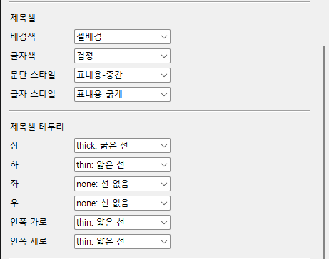

제목셀 설정에서 바꿀 수 있는 항목은 다음과 같습니다.

- 배경색
- 글자색
- 문단 스타일
- 글자 스타일
- 위쪽 선
- 아래쪽 선
- 왼쪽 선
- 오른쪽 선
- 안쪽 가로선
- 안쪽 세로선

제목셀 모양을 바꾸고 싶다면 먼저 색상 팔레트와 선 프리셋을 정한 뒤 제목셀 설정을 바꿉니다.

### 8.4 셀 안 여백

셀 안 여백은 셀 경계선과 글자 사이의 간격입니다.

글자가 선에 너무 붙어 보이면 셀 안 여백을 늘립니다. 표가 답답해 보이면 여백을 줄입니다. 왼쪽, 오른쪽, 위, 아래 값을 따로 정할 수 있습니다.

### 8.5 표 바깥 여백

표 바깥 여백은 표와 본문 사이의 간격입니다.

보고서에서는 표 아래쪽 간격이 특히 중요합니다. 표와 다음 문단이 붙어 보이면 아래쪽 바깥 여백을 늘립니다.

### 8.6 Markdown 표 설정

마크다운 표를 한글 표로 바꾼 뒤 적용할 기본 서식을 정합니다.

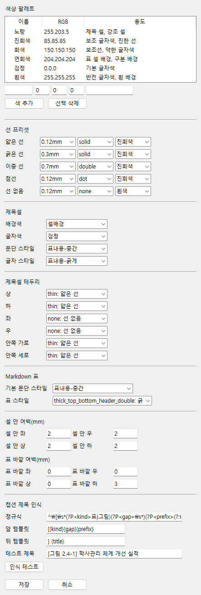

주로 확인할 항목은 다음과 같습니다.

- 기본 문단 스타일
- 표 선 스타일
- 셀 안 여백
- 표 바깥 여백
- 너비맞추기 결과

마크다운 표를 자주 붙여넣는다면 이 설정을 먼저 맞춰 두는 편이 좋습니다.

마크다운 표 변환 중 한글의 붙여넣기 선택 창이 뜨면 `원본 형식 유지`를 선택해야 합니다. 이 옵션을 골라야 앱이 클립보드에 넣은 HTML 표 형식을 한글 표로 가져올 수 있습니다.

### 8.7 표 스타일 버튼

표 스타일 버튼은 표 전체 선과 제목셀 모양을 함께 정리합니다. 표 안에 커서를 둔 뒤 원하는 표 스타일 아이콘을 누릅니다.

이 기능은 다음 작업을 한 번에 시도합니다.

1. 표 전체 셀을 선택합니다.
2. 선택한 표 선 스타일을 적용합니다.
3. 첫 줄을 선택합니다.
4. 제목셀 속성을 적용합니다.
5. 제목셀 문단 스타일과 글자 스타일을 적용합니다.
6. 제목셀 배경색을 적용합니다.
7. 필요한 프리셋에서는 헤더 아래 이중선을 적용합니다.

복잡하게 병합된 표에서는 일부 단계가 실패할 수 있습니다. 실패하면 표를 단순한 형태에서 먼저 시험해 보고 필요한 기능을 나누어 적용합니다.

### 8.8 엑셀표 정리

`엑셀표 정리`는 엑셀에서 붙여넣은 표를 간단히 정리할 때 사용합니다. 선택한 표 또는 셀에 흰색 배경, 검정 글자색, 얇은 전체 테두리, `표내용-중간` 문단 스타일을 적용하려고 합니다.

이 기능은 세밀한 표 디자인을 완성하는 기능이 아니라 엑셀에서 온 표의 기본 모양을 정돈하는 기능입니다. 제목셀 색이나 상하선 모양까지 맞추려면 `표 편집` 탭의 표 스타일 버튼이나 `제목셀 자동화`를 이어서 사용합니다.

`표내용-중간` 스타일이 현재 한글 문서에 없으면 문단 스타일 적용은 실패할 수 있습니다. 이때는 한글 문서에 같은 이름의 스타일을 불러오거나 앱의 스타일 세트에서 표용 스타일 이름을 확인합니다.

## 9. 캡션 설정

### 9.1 캡션원클릭 흐름

`캡션원클릭`은 표 제목 문장을 실제 한글 캡션으로 옮기는 기능입니다.

기본 흐름은 다음과 같습니다.

1. 사용자가 캡션 후보 문장을 선택합니다.
2. 앱이 문장에서 표 또는 그림 종류를 읽습니다.
3. 번호 앞부분과 제목 뒷부분을 나눕니다.
4. 근처 표를 찾습니다.
5. 한글의 캡션 기능을 실행합니다.
6. 캡션 내용을 넣습니다.
7. 캡션 스타일을 적용합니다.

### 9.2 기본 캡션 형식

기본으로 다음 형식을 인식합니다.

```text
[표 5.4-8] 샘플표제통
[그림 2.4-1] 학사관리 체계 개선 실적
```

대괄호 안에는 `표` 또는 `그림`이 들어갑니다. 그 뒤에는 번호가 들어갑니다. 대괄호 뒤에는 제목이 들어갑니다.

### 9.3 인식 가능한 캡션 형식

캡션원클릭은 정해진 형태의 문장만 인식합니다. 기본 설정에서는 다음 조건을 모두 지켜야 합니다.

1. 문장이 대괄호 `[`와 `]`로 시작해야 합니다.
2. 대괄호 안 첫 낱말은 `표` 또는 `그림`이어야 합니다.
3. 번호 앞부분에는 하이픈 `-`이 있어야 합니다.
4. 대괄호 뒤에는 캡션 제목을 씁니다.

기본으로 잘 인식하는 형태는 다음과 같습니다.

```text
[표 1-1] 부서별 제출 현황
[표 5.4-8] 샘플표제통
[그림 2.4-1] 학사관리 체계 개선 실적
[그림 3-2] 업무 처리 흐름
```

앱은 이 문장을 읽을 때 번호 앞부분과 제목을 나눕니다. 예를 들어 `[표 5.4-8] 샘플표제통`은 다음처럼 나누어 봅니다.

- 종류: `표`
- 번호 앞부분: `5.4-`
- 번호: `8`
- 제목: `샘플표제통`

이렇게 나누어야 한글의 표 번호 또는 그림 번호를 캡션 안에 넣고 제목을 이어 붙일 수 있습니다.

다음 형태는 기본 설정에서 인식하지 못할 수 있습니다.

```text
표 1-1 부서별 제출 현황
[표 1] 부서별 제출 현황
[표 1.1] 부서별 제출 현황
[사진 1-1] 행사 사진
[도표 1-1] 부서별 제출 현황
표: 부서별 제출 현황
```

위 예시는 대괄호가 없거나 `표`와 `그림`이 아닌 낱말을 쓰거나 하이픈이 없어서 기본 규칙과 맞지 않습니다.

번호 체계를 다르게 쓰는 부서에서는 `표 설정`의 캡션 제목 인식 규칙을 바꿀 수 있습니다. 다만 규칙을 바꾸기 전에는 현재 샘플 문장이 인식 테스트에서 원하는 대로 나뉘는지 먼저 확인합니다.

### 9.4 캡션 인식 테스트

`표 설정`의 캡션 제목 인식 항목에서 샘플 문장을 넣고 인식 테스트를 할 수 있습니다.

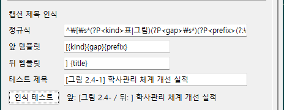

인식 테스트 결과에서 앞부분과 뒷부분이 예상대로 나뉘는지 확인합니다. 원하는 대로 나뉘지 않으면 패턴이나 템플릿을 조정해야 합니다.

### 9.5 캡션 스타일

캡션원클릭 뒤에 캡션 스타일을 자동 적용하려면 스타일 세트에 캡션 스타일을 등록해야 합니다. 해당 스타일에는 `캡션`을 체크합니다.

예를 들어 한글 문서에서 캡션 스타일 이름이 `[표/그림] 캡션`이라면 스타일 세트에도 같은 이름을 넣고 `캡션`을 체크합니다.

### 9.6 표 번호에서 제외할 표

캡션원클릭은 표 캡션에 한글의 표 번호 개체를 넣습니다. 한글은 표 번호 개체를 기준으로 표 번호를 이어 갑니다.

보고서 안에는 번호를 붙이지 않아야 하는 표가 들어갈 수 있습니다. 예를 들어 표 안에 작은 보조 표를 넣거나 증빙용 배치 표를 넣는 경우입니다. 이런 표까지 표 번호로 잡히면 뒤에 나오는 표 번호가 하나씩 밀릴 수 있습니다.

번호에서 빼야 할 표는 다음 순서로 처리합니다.

1. 번호에서 제외할 표를 선택합니다.
2. `표 편집` 탭의 `번호종류`를 확인합니다.
3. `없음`을 누릅니다.
4. 뒤쪽 표 캡션 번호가 맞는지 확인합니다.

표 번호로 다시 넣어야 하면 같은 위치에서 `표`를 누릅니다. 그림 번호로 바꿔야 하는 개체라면 `그림`을 누릅니다.

번호가 이상하게 이어질 때는 캡션 문장만 확인하지 말고 문서 안에 번호 종류가 잘못 지정된 표가 있는지도 확인합니다.

## 10. 쪽 편집

### 10.1 머리말, 꼬리말, 쪽번호 감추기

`쪽 편집` 탭에서는 머리말, 꼬리말, 쪽번호를 감출 수 있습니다. 이 기능은 문서 전체의 쪽 모양에 영향을 줄 수 있으므로 실행 전에 저장하는 편이 좋습니다.

### 10.2 새 번호 개체

새 번호 개체는 한글의 자동 번호 필드를 넣을 때 사용합니다.

- `새 쪽 번호`: 현재 위치에 쪽 번호 개체를 넣습니다.
- `새 표 번호`: 표 캡션에 사용할 표 번호 개체를 넣습니다.
- `새 그림 번호`: 그림 캡션에 사용할 그림 번호 개체를 넣습니다.

번호를 넣을 위치에 커서를 둔 뒤 실행해야 하며, 표나 캡션처럼 번호가 들어갈 자리에서 사용하는 것이 안전합니다.

### 10.3 머리말 개체

머리말 개체는 문서 상단의 머리말 영역을 빠르게 만드는 버튼입니다.

- `머리말 양쪽`: 홀수쪽과 짝수쪽에 공통으로 쓰는 머리말을 만듭니다.
- `머리말 짝수쪽`: 짝수쪽 전용 머리말을 만듭니다.
- `머리말 홀수쪽`: 홀수쪽 전용 머리말을 만듭니다.

실행 전에는 머리말 안이 아니라 본문 쪽에 커서를 두는 것이 좋습니다. 이미 머리말/꼬리말 편집 상태이거나 본문이 아닌 위치에 있으면 삽입이 실패할 수 있습니다.

번호를 넣을 위치에 커서를 둔 뒤 버튼을 누릅니다. 커서가 입력 가능한 위치에 없으면 실패할 수 있습니다.

## 11. 특수문자

### 11.1 글자 겹치기

`특수문자` 탭의 글자 겹치기는 한글의 글자 겹치기 기능을 이용해 두 글자를 겹쳐 넣는 기능입니다.

예를 들어 네모 문자와 체크 표시를 겹치면 체크박스처럼 보이는 글자를 만들 수 있습니다. 숫자를 네모 안에 넣는 용도로도 쓸 수 있습니다.

기본 사용 순서는 다음과 같습니다.

1. 한글 문서에서 글자를 넣을 위치에 커서를 둡니다.
2. `특수문자` 탭을 엽니다.
3. 겹칠 글자나 숫자를 입력합니다.
4. `넣기`를 누릅니다.
5. 한글 문서에 겹치기글자가 들어갔는지 확인합니다.

커서가 표 밖이나 입력할 수 없는 위치에 있으면 실패할 수 있습니다. 이때는 한글 문서에서 글자를 넣을 위치를 다시 클릭한 뒤 실행합니다.

### 11.2 체크박스

체크박스는 문서 안에 체크 표시를 넣을 때 사용합니다.

일반 체크 표시 문자와 겹치기글자로 만든 체크박스를 넣을 수 있습니다. 입력할 위치에 커서를 둔 뒤 원하는 버튼을 누릅니다.

겹치기글자로 만든 체크박스는 네모와 체크 표시를 겹쳐 만든 모양입니다. 보고서 양식에서 체크 표시가 네모 안에 들어가야 할 때 사용합니다.

### 11.3 자주 쓰는 특수문자

자주 쓰는 특수문자는 직접 등록할 수 있습니다.

관리 화면에서 버튼 이름과 삽입 문자를 넣고 저장합니다. 순서를 바꾸거나 필요 없는 문자를 삭제할 수 있습니다.

## 12. 양식, 증빙 PDF, 그림, 로고

### 12.1 표지 만들기

표지를 만들려면 제목, 날짜, 부서명을 한글 문서에 적고 선택합니다.

예시는 다음과 같습니다.

```text
제목: 비교과 프로그램 운영 현황
날짜: 오늘
부서: 교육혁신처
```

날짜를 생략하면 앱이 기본 날짜를 넣습니다. `오늘` 또는 `{{오늘}}`이라고 쓰면 현재 날짜를 넣습니다.

선택한 내용이 2줄뿐이면 앱은 제목과 부서명을 우선 읽습니다.

### 12.2 보고양식 불러오기

보고양식 불러오기는 정해진 보고서 양식에 제목, 날짜, 부서명을 채운 뒤 문서에 넣습니다.

빈 문서에서 보고서를 시작할 때 사용하면 좋습니다. 기존 문서 중간에 넣을 수도 있으므로 커서 위치를 확인한 뒤 실행합니다.

### 12.3 대제목 번호박스 삽입

대제목 번호박스는 큰 제목 앞에 번호가 들어간 상자를 넣는 기능입니다. 제목 글자를 선택한 상태에서 실행하면 선택한 글자를 번호박스 양식 안에 넣습니다. 선택한 글자가 없으면 커서 위치에 빈 번호박스를 넣습니다.

앱은 문서 안에 이미 들어간 번호박스를 읽어 다음 번호를 계산하려고 합니다. 기존 번호박스가 양식과 다르거나 직접 고친 모양이면 다음 번호가 예상과 다를 수 있습니다. 삽입 뒤 번호와 제목을 확인합니다.

번호박스 양식을 바꾸고 싶다면 `스타일/정리 > 관리`에서 현재 스타일 세트의 `기본 title_number_box 템플릿` 경로를 바꿉니다. 특정 스타일만 다른 양식을 쓰고 싶다면 그 스타일을 선택한 뒤 `이 스타일 번호박스 템플릿`을 따로 지정합니다. 이 설정은 스타일 세트별로 저장되므로, 같은 문서라도 선택한 스타일 세트와 스타일에 따라 다른 번호박스 양식을 쓸 수 있습니다.

양식을 바꿀 때는 다음 제약을 지켜야 합니다.

- 번호 자리에는 `{{no}}`, 제목 자리에는 `{{header}}`, 식별자 자리에는 `{{bufs_title}}`를 넣습니다.
- `{{bufs_title}}`는 기존 번호박스를 찾고 다음 번호를 계산할 때 쓰는 기준 표식이므로 유지해야 합니다.
- `{{no}}`와 `{{header}}`는 자동 치환용 placeholder입니다. 템플릿 안에서 각각 한 번만 두는 편이 안전합니다.
- 번호박스는 1행 3열 표 구조가 가장 안정적입니다.
- 1열은 번호, 2열은 제목, 3열은 숨김 식별자 용도로 두는 구성이 가장 안전합니다.
- 파일 삽입 자체는 더 복잡한 표도 가능하지만, 현재 번호 인식과 예비 그리기 경로는 1행 3열 구조를 기준으로 검증돼 있습니다.
- 3열에는 반드시 `{{bufs_title}}` 텍스트가 들어 있어야 합니다. 1pt 흰색으로 설정해주세요.
- 셀 너비, 높이, 테두리, 배경색, 정렬, 글꼴 같은 표 모양은 바꿔도 됩니다.
- 병합셀, 여러 행, 복잡한 도형 조합, 표 바깥 장식은 자동 번호 인식이나 삽입 결과를 불안정하게 만들 수 있습니다.

양식을 바꾼 뒤에는 다음 순서로 확인하는 편이 좋습니다.

1. `대제목 번호박스 삽입`으로 단건 삽입을 먼저 시험합니다.
2. 번호와 제목 치환이 맞는지 확인합니다.
3. 기존 번호박스가 있는 문서에서 한 번 더 삽입해 다음 번호 계산이 맞는지 확인합니다.
4. 마지막으로 `일괄처리`에서 대제목 문단이 번호박스로 바뀌는지 확인합니다.

### 12.4 증빙 PDF 삽입

증빙 PDF 삽입은 PDF 파일을 이미지로 바꾼 뒤 증빙 양식에 넣습니다. `증빙 PDF 1건 삽입`은 PDF 하나를 넣고 `증빙 PDF 폴더 삽입`은 선택한 폴더 안의 PDF 파일을 이름순으로 넣습니다.


| 설정 또는 버튼 | 설명 |
| --- | --- |
| `해상도(dpi)` | PDF를 이미지로 바꿀 때 쓰는 해상도입니다. 높을수록 선명하지만 처리 시간이 길어지고 문서 용량이 커집니다. 72부터 600 사이 정수로 입력합니다. |
| `가로 자동 회전` | 가로 방향 PDF 쪽을 돌려 넣으려고 합니다. |
| `증빙 PDF 1건 삽입` | PDF 파일 하나를 골라 넣습니다. |
| `증빙 PDF 폴더 삽입` | 폴더 안의 PDF 파일을 이름순으로 넣습니다. |

PDF 파일에 페이지가 없거나 암호가 걸려 있거나 이미지 변환이 실패하면 해당 파일을 넣지 못할 수 있습니다. 폴더 삽입에서는 일부 파일만 실패할 수 있으므로 완료 메시지에서 실패 건수를 확인합니다.

### 12.5 그림 도구

| 버튼 | 설명 |
| --- | --- |
| `그림 왼쪽 90도` | 선택한 그림 개체를 왼쪽으로 돌립니다. |
| `그림 오른쪽 90도` | 선택한 그림 개체를 오른쪽으로 돌립니다. |
| `선택 그림 셀 맞춤` | 셀 안의 그림 개체를 현재 셀 크기에 맞춥니다. |


그림 회전은 회전 뒤 선택한 셀 크기에 맞추려고 시도합니다. 그림을 선택하지 않았거나 그림이 표 셀 안에 있지 않으면 셀 맞춤이 실패할 수 있습니다. 증빙 이미지를 넣은 뒤 크기가 어긋나 보일 때 사용합니다.

### 12.6 로고 삽입

로고 삽입은 앱에 등록된 BUFS 로고 이미지를 현재 커서 위치에 넣습니다.

로고 목록에서 원하는 로고를 고른 뒤 삽입합니다. 앱은 가능한 한 이미지 비율을 유지합니다.

## 13. 커스터마이징 예시

### 13.1 스타일 모양 변경

앱은 한글 문서 안의 스타일을 이름으로 찾아 적용합니다. 글꼴, 글자 크기, 문단 간격, 들여쓰기, 번호 모양을 바꾸고 싶다면 앱의 스타일 이름을 바꾸기보다 한글 문서에서 같은 이름의 스타일을 편집합니다.

예를 들어 앱 설정에 `본문-개요1`이라는 스타일이 등록되어 있다면 한글 문서에도 `본문-개요1` 스타일이 있어야 합니다. 이 이름은 그대로 두고 한글의 스타일 편집에서 모양만 바꿉니다.

스타일을 바꾼 뒤 같은 이름의 스타일이 앱에서 적용되는지 짧은 문장으로 시험합니다. 스타일을 새로 만들었거나 불러왔는데도 적용되지 않으면 `상태` 탭에서 `한글 다시 연결`을 누른 뒤 다시 시험합니다.

한글 스타일을 직접 다루는 방법은 아래 한글 2024 도움말을 참고합니다.

- [스타일 추가하기](https://help.hancom.com/hoffice130_assistant/ko-KR/Hwp/index.htm#t=format%2Fstyle%2Fstyle(new).htm)
- [스타일 편집하기](https://help.hancom.com/hoffice130_assistant/ko-KR/Hwp/index.htm#t=format%2Fstyle%2Fstyle(edit).htm)
- [스타일 적용하기](https://help.hancom.com/hoffice130_assistant/ko-KR/Hwp/index.htm#t=format%2Fstyle%2Fstyle(apply).htm)

### 13.2 새 스타일 추가

새 스타일을 쓰려면 한글 문서와 앱의 스타일 목록에 같은 이름을 등록해야 합니다. 한쪽에만 있으면 앱이 스타일을 찾지 못하거나 사용자가 버튼에서 고를 수 없습니다.

먼저 한글 문서에서 새 스타일을 만듭니다. 예를 들어 `본문-주의`라는 문단 스타일을 만들었다면 앱에서도 같은 이름인 `본문-주의`를 추가합니다.

그다음 `스타일/정리` 탭에서 `관리`를 누릅니다. 현재 쓰는 스타일 세트를 선택하고 스타일 목록에 `본문-주의`를 추가합니다. 문단 전체에 적용할 스타일이면 문단 스타일로, 일부 글자에만 적용할 스타일이면 글자 스타일로 등록합니다.

일괄처리에서 자동으로 잡아야 하는 스타일이라면 식별자 또는 개요 표시자도 넣습니다. 표 안에서 쓰는 스타일이면 `표`를 체크합니다. 캡션으로 쓸 스타일이면 `캡션`을 체크합니다.

저장한 뒤 한글 문서에서 짧은 문장에 새 스타일을 적용해 봅니다. 새로 만든 스타일이 적용되지 않으면 `상태` 탭에서 `한글 다시 연결`을 누른 뒤 다시 시험합니다.

한글에서 새 스타일을 만드는 방법은 한글 2024 도움말의 스타일 추가하기를 참고합니다.

- [스타일 추가하기](https://help.hancom.com/hoffice130_assistant/ko-KR/Hwp/index.htm#t=format%2Fstyle%2Fstyle(new).htm)

### 13.3 공통 양식 변경

매번 새 문서에 들어가는 기본 스타일과 표지, 보고양식 모양을 바꾸려면 설치 폴더의 `bufs/templates`에 있는 양식 파일을 관리합니다.


다만 일반 사용자가 양식 파일을 직접 열어 작업하면 원본 양식을 잘못 바꿀 수 있습니다. 개인 문서에서 스타일만 가져오려면 한글의 `스타일 불러오기`에서 `bufs/templates`의 양식 파일을 선택합니다. 현재 문서에 보고양식을 넣고 싶다면 앱의 `양식/그림` 탭에서 `보고양식 불러오기`를 누릅니다.

양식 파일 자체를 바꿀 때는 자리표시자와 파일 위치를 함께 확인해야 합니다. 자세한 주의 사항은 `16.3 로고와 템플릿 관리`를 참고합니다.

### 13.4 본문 식별자 변경

`스타일/정리` 탭에서 `관리`를 누릅니다. 현재 쓰는 스타일 세트를 선택합니다. `ㅇ`에 해당하는 본문 개요 스타일을 고른 뒤 식별자 또는 개요 표시자에 `○`를 추가합니다.

저장한 뒤 한글 문서에서 다음 문장을 선택하고 `일괄처리`를 시험합니다.

```text
○ 추진 배경
```

원하는 문단 스타일이 적용되면 설정이 맞습니다.

이 설정은 일괄처리할 때 어떤 문장을 어떤 스타일로 볼지 정하는 설정입니다. 한글 문서에 실제로 보이는 번호 모양이나 문단 모양을 바꾸려면 `13.1 스타일 모양을 바꾸고 싶습니다`를 참고해 한글 문서의 스타일을 편집합니다.

### 13.5 표 안 식별자 변경

표 안 개요 스타일에는 `표`를 체크합니다. 번호 그룹은 보통 `table`로 둡니다. 단계는 표 안 개요의 깊이에 맞게 정합니다.

예를 들어 표 안 1단계 항목에는 `표내용-개요번호-레벨1`을 쓰고 2단계 항목에는 `표내용-개요번호-레벨2`를 쓸 수 있습니다.

표 안에서 `표점` 대신 `-`를 쓰고 싶다면 해당 표용 스타일의 식별자 또는 개요 표시자에 `-`를 추가합니다.

이 설정도 표 안 문장을 인식하기 위한 식별자를 바꾸는 작업입니다. 표 안 문단의 실제 번호 모양, 글자 모양, 정렬을 바꾸려면 한글 문서의 같은 이름 스타일을 편집합니다.

### 13.6 제목셀 색 변경

`표 편집` 탭에서 `표 설정`을 누릅니다. 먼저 색상 팔레트에 원하는 색이 있는지 확인합니다. 없으면 색을 추가합니다.

그다음 제목셀 설정에서 배경색을 원하는 색으로 바꿉니다. 저장한 뒤 표에서 `제목셀 자동화`를 시험합니다.

### 13.7 캡션 스타일 이름 불일치

현재 한글 문서의 캡션 스타일 이름을 확인합니다. `스타일/정리` 탭에서 `관리`를 누르고 해당 이름을 문단 스타일로 추가합니다.

그 스타일에 `캡션`을 체크합니다. 저장한 뒤 캡션 후보 문장을 선택하고 `캡션원클릭`을 시험합니다.

### 13.8 자동 굵게 실패

먼저 글자 스타일이 스타일 세트에 등록되어 있는지 확인합니다. 본문용 굵게 스타일에는 `body_bold` 역할을 넣습니다. 표용 굵게 스타일에는 `table_bold` 역할을 넣습니다.

역할이 비어 있으면 앱이 어떤 글자 스타일을 써야 할지 찾지 못합니다.

### 13.9 하위 번호 재시작 실패

하위 번호가 계속 이어질 때는 앱이 어느 문단을 상위 항목으로 보고 어느 문단을 하위 항목으로 볼지 알 수 있게 설정해야 합니다.

예를 들어 아래처럼 정리하고 싶다고 가정합니다.

```text
1. 추진 배경
  1) 현황
  2) 문제점
2. 추진 내용
  1) 세부 계획
  2) 기대 효과
```

이때 `추진 배경`과 `추진 내용`은 상위 항목입니다. `현황`, `문제점`, `세부 계획`, `기대 효과`는 하위 항목입니다. 새 상위 항목인 `추진 내용`이 나오면 하위 번호는 `3)`이 아니라 `1)`부터 다시 시작해야 합니다.

앱에서 이 관계를 알려 주려면 상위 스타일과 하위 스타일의 그룹을 같게 둡니다. 본문 번호라면 보통 그룹을 `body`로 둡니다. 표 안 번호라면 보통 그룹을 `table`로 둡니다.

그다음 단계가 맞는지 확인합니다. 상위 항목은 1단계, 하위 항목은 2단계처럼 정합니다. 3단계 번호까지 쓴다면 그 아래 스타일은 3단계로 둡니다.

마지막으로 하위 스타일에 `상위 개요 뒤 새 번호`를 체크합니다. 위 예시에서는 `현황`, `문제점`, `세부 계획`, `기대 효과`에 적용되는 하위 스타일에 이 설정을 켭니다. 상위 스타일이 아니라 다시 시작되어야 하는 하위 스타일에 켜야 합니다.

표 안 번호가 본문 번호와 서로 영향을 주면 그룹이 섞였을 가능성이 큽니다. 본문 스타일은 `body`, 표 안 스타일은 `table`처럼 나누어 둡니다.

한두 곳만 급하게 고치면 되는 상황이라면 해당 하위 문단에 커서를 두고 `스타일/정리` 탭의 `새 번호`를 누릅니다. 같은 문제가 반복되면 수동으로 누르기보다 스타일 설정을 고치는 편이 좋습니다.

### 13.10 마크다운 표 모양 변경

`표 편집` 탭에서 `표 설정`을 누릅니다. Markdown 표 항목에서 기본 문단 스타일과 표 스타일을 바꿉니다.

표가 너무 붙어 보이면 셀 안 여백과 표 바깥 여백도 함께 조정합니다.

## 14. 문제 해결

### 14.1 한글 연결 실패

한글 문서를 먼저 열었는지 확인합니다. 문서를 열었는데도 찾지 못하면 `상태` 탭에서 다시 연결합니다.

계속 실패하면 한글이 정상 실행 중인지 확인합니다. PC 환경에 따라 한글 보안 모듈 설정이 필요할 수 있습니다.

### 14.2 대상 문서 불일치

한글 창이 여러 개 열려 있으면 대상 문서가 달라질 수 있습니다. 원하는 한글 문서를 앞으로 가져온 뒤 다시 연결합니다. `상태` 탭에서 대상 문서를 다시 확인합니다.

### 14.3 버튼 동작 없음

먼저 한글에서 선택 영역이 있는지 확인합니다. 표 기능이라면 커서가 표 안에 있는지 확인합니다.

스타일 적용 기능이라면 현재 문서에 같은 이름의 스타일이 있는지 확인합니다.

### 14.4 스타일 적용 오류

현재 선택한 스타일 세트가 맞는지 확인합니다. 앱 설정의 스타일 이름과 한글 문서의 스타일 이름이 같은지도 확인합니다.

현재 문서의 확장자도 확인합니다. `.hwp` 형식 문서에서는 앱이 스타일 목록을 제대로 확인하지 못할 수 있습니다. 한글에서 `다른 이름으로 저장`을 눌러 `.hwpx` 형식으로 저장한 뒤 `상태` 탭에서 `한글 다시 연결`을 누르고 다시 적용합니다.

스타일 이름이 맞지 않으면 한글의 스타일 불러오기에서 설치 폴더의 `bufs/templates`에 있는 양식 파일을 선택해 스타일을 가져옵니다. 또는 `양식/그림` 탭에서 보고양식을 현재 문서에 불러옵니다.

한글에서 스타일을 새로 만들었거나 가져온 직후라면 `상태` 탭에서 `한글 다시 연결`을 누른 뒤 다시 적용합니다.

다른 양식 문서에서 가져온 문단은 스타일 이름이 같아 보여도 실제 속성이 다를 수 있습니다. 가능하면 정해진 보고서 양식을 기준으로 작업합니다.

### 14.5 표 기능 실패

표 안에 커서를 두었는지 확인합니다. 셀을 선택한 상태에서도 다시 시험합니다.

병합 셀이 많거나 구조가 복잡한 표에서는 일부 기능이 실패할 수 있습니다. 이때는 표 전체 자동화 대신 선, 색상, 제목셀 기능을 나누어 적용합니다.

표내용 스타일 버튼에 원하는 스타일이 보이지 않으면 `스타일/정리` 탭의 `관리`를 엽니다. 해당 문단 스타일이 현재 스타일 세트에 들어 있는지 확인하고 `표`가 체크되어 있는지 확인합니다.

### 14.6 캡션원클릭 실패

캡션 후보 문장 형식을 확인합니다.

```text
[표 5.4-8] 샘플표제통
```

이런 형식으로 되어 있는지 확인합니다. 기본 설정에서는 대괄호 안에 `표` 또는 `그림`이 있어야 하며 번호 앞에 하이픈이 있어야 합니다. `[표 1] 제목`, `[표 1.1] 제목`, `표 1-1 제목`처럼 쓰면 인식하지 못할 수 있습니다.

바로 아래나 근처에 표가 있는지도 확인합니다. 그래도 실패하면 `표 설정`의 캡션 인식 테스트에서 샘플 문장이 잘 나뉘는지 확인합니다.

### 14.7 표 번호 밀림

표 번호가 예상보다 커지거나 중간에 건너뛰면 번호를 매기면 안 되는 표가 표 번호로 잡혔는지 확인합니다. 표 안의 보조 표나 배치용 표가 원인일 수 있습니다.

번호에서 제외할 표를 선택한 뒤 `표 편집` 탭의 `번호종류`에서 `없음`을 누릅니다. 그다음 뒤쪽 표 캡션 번호가 맞는지 확인합니다.

### 14.8 자동 굵게 실패

글자 스타일과 역할을 확인합니다. 자동 굵게는 문단 스타일이 아니라 글자 스타일에만 적용됩니다.

`스타일/정리` 탭에서 `관리`를 누른 뒤 굵게용 스타일의 종류가 `글자`인지 확인합니다. 본문에서는 보통 `body_bold` 역할이 필요합니다. 표 안에서는 보통 `table_bold` 역할이 필요합니다. 사용하는 설정에서 `text_bold` 같은 다른 이름을 쓰기로 했다면 그 이름을 글자 스타일 역할에 넣습니다.

그다음 `규칙` 탭을 엽니다. 첫머리 괄호 키워드, 첫머리 콜론 앞, 마크다운 굵게 같은 규칙의 글자 역할이 실제 글자 스타일의 역할과 같은지 확인합니다. 현재 스타일 세트에 해당 역할이 없거나 규칙의 글자 역할과 다르면 자동 굵게를 건너뜁니다.

### 14.9 번호 이어짐 오류

번호 그룹과 단계를 확인합니다. 본문 번호와 표 안 번호가 같은 그룹으로 묶여 있으면 서로 영향을 줄 수 있습니다.

하위 번호가 다시 시작되어야 한다면 하위 스타일에 `상위 개요 뒤 새 번호`가 켜져 있는지 확인합니다.

특정 문단 하나만 바로 고치려면 해당 문단에 커서를 두고 `스타일/정리` 탭의 `새 번호`를 누릅니다. 번호가 없는 일반 문단에서는 실패할 수 있습니다.

번호가 다시 시작되면 안 되는 문단이 1번부터 시작했다면 해당 문단에 커서를 두고 `이어서`를 누릅니다.

### 14.10 숫자 정리 중단

앱은 숫자를 잘못 바꿀 위험이 있으면 변환을 중단할 수 있습니다. 콤마 위치가 이상한 숫자, 소수점을 콤마처럼 쓴 숫자, 변환 대상 단위가 아닌 값이 섞여 있으면 경고가 뜹니다.

표 셀 여러 칸을 한꺼번에 선택한 숫자 블록도 중단될 수 있습니다. 한글 붙여넣기에서 셀 내용이 흐트러질 수 있기 때문입니다. 이때는 한 셀 안의 텍스트만 선택하거나 셀 범위를 다시 블록 선택한 뒤 실행합니다.

### 14.11 양식과 증빙 PDF 삽입 실패

보고양식, 대제목 번호박스, 증빙 PDF는 현재 커서 위치에 새 내용을 넣습니다. 커서가 입력 가능한 위치에 있는지 먼저 확인합니다.

증빙 PDF는 PDF를 이미지로 바꾼 뒤 삽입합니다. 암호가 걸린 PDF, 손상된 PDF, 페이지가 없는 PDF는 실패할 수 있습니다. 해상도 값이 72보다 작거나 600보다 크면 실행하지 않습니다.

폴더 삽입에서는 일부 PDF만 실패할 수 있습니다. 완료 메시지와 `상태` 탭의 로그에서 실패한 파일 이름을 확인합니다.

### 14.12 그림 도구 실패

그림 회전과 셀 맞춤은 그림 개체를 선택한 상태에서 실행해야 합니다. 글자처럼 취급된 그림이나 표 셀 밖의 그림에서는 셀 크기 맞춤이 실패할 수 있습니다.

증빙 이미지 크기가 어긋나면 그림을 직접 선택한 뒤 `선택 그림 셀 맞춤`을 다시 누릅니다. 회전 뒤 셀 맞춤이 실패했다는 안내가 나오면 그림이 들어 있는 셀을 확인합니다.

## 15. 따라 해보기

### 15.1 표지 만들기

아래 내용을 한글 문서에 입력한 뒤 선택합니다. `양식/그림` 탭에서 표지 만들기를 누릅니다.

```text
제목: 비교과 프로그램 운영 현황
날짜: 오늘
부서: 교육혁신처
```

표지가 만들어지고 제목, 날짜, 부서명이 들어가는지 확인합니다.

### 15.2 보고양식 불러오기

아래 내용을 선택한 뒤 보고양식 불러오기를 누릅니다.

```text
제목: 2026학년도 대학혁신지원사업 자체점검 결과 보고
부서: 대학성과분석센터
날짜: 2026. 8. 3.
```

보고양식에 입력값이 들어가는지 확인합니다.

### 15.3 본문 일괄처리

아래 문장을 한글에 붙여넣고 전체를 선택합니다. `스타일/정리` 탭에서 `일괄처리`를 누릅니다.

```text
ㅇ (배경) 외국인전임교원이 국내정착을 지원하기 위하여 매월 주거보조비를 지급하고 있음.
ㅇ 목적: 신임교원의 조기 적응과 안정적인 교육활동을 지원하고자 함.
- 세부 계획: 부서별 담당자를 지정하고 월별 점검표를 작성함.
ㆍ (유의 사항) 괄호 안 키워드는 괄호까지 굵게 적용되어야 함.
```

개요 스타일과 굵게 처리가 원하는 대로 들어갔는지 확인합니다.

### 15.4 마크다운 굵게 정리

아래 문장을 선택하고 `일괄처리`를 누릅니다.

```text
ㅇ **(항공료)** 계약에 근거하여 해외에서 입국하는 신임교원에게 항공료를 지급함.
ㅇ 지급 기준: **신임교원 및 교환교수**의 계약 조건에 따라 지급함.
```

별표가 사라지고 안쪽 글자에 굵게가 적용되는지 확인합니다.

### 15.5 마크다운 표 변환

아래 표를 머리글부터 마지막 행까지 선택한 뒤 `표 편집` 탭에서 `markdown 표 → 한글 표`를 누릅니다.

```text
| 구분 | 내용 | 비고 |
| --- | --- | --- |
| 계획 | 세부 일정 수립 | 8월 |
| 실행 | 부서별 자료 취합 | 9월 |
| 점검 | 결과 보고서 작성 | 10월 |
```

한글에서 붙여넣기 선택 창이 뜨면 `원본 형식 유지`를 선택합니다. 한글 버전에 따라 `원본` 또는 `원본 형식`으로 보일 수 있습니다. 한글 표로 바뀌는지 확인합니다. 표 선과 셀여백도 함께 확인합니다.

### 15.6 괄호 씌우기

아래 문장에서 규정명 부분만 선택합니다.

```text
교원 인사 규정에 따라 심사합니다.
```

`교원 인사 규정`만 선택한 뒤 `스타일/정리` 탭에서 `「 」 씌우기`를 누릅니다.

아래처럼 규정명에 낫표 괄호가 들어가는지 확인합니다.

```text
｢교원 인사 규정｣에 따라 심사합니다.
```

### 15.7 캡션원클릭

아래 문장을 표 위에 입력합니다.

```text
[표 5.4-8] 샘플표제통
```

문장을 선택하고 바로 아래 표를 둔 상태에서 `캡션원클릭`을 누릅니다. 표 캡션이 만들어지고 캡션 스타일이 적용되는지 확인합니다.

### 15.8 날짜 정리

아래 문장을 선택한 뒤 날짜 정규화 버튼을 시험합니다.

```text
2026년 7월 22일 회의 개최
2026.7.22. 결과 보고
2026-07-22 자료 제출
2026. 7. 2. 최종 확인
```

원하는 날짜 형식으로 통일되는지 확인합니다.

### 15.9 숫자 정리

아래 문장을 선택한 뒤 쉼표 넣기, 쉼표 빼기, 단위 변환을 시험합니다.

```text
총사업비는 1200000원이며 집행액은 987654원입니다.
전년도 예산은 1,250,000원이고 올해 예산은 1350000원입니다.
인건비는 2500천원이고 운영비는 3백만원입니다.
```

숫자가 원하는 형식으로 바뀌는지 확인합니다. 날짜나 학년도 같은 숫자가 함께 들어 있을 때는 결과를 더 꼼꼼히 확인합니다.

## 16. 관리자 참고

### 16.1 스타일 세트 관리

부서 양식이 바뀌면 스타일 세트를 먼저 확인합니다. 한글 문서의 스타일 이름과 앱의 스타일 이름을 맞춥니다.

기존 세트를 바로 고치기보다 복사본을 만들어 시험하는 편이 안전합니다. 새 세트에서 테스트한 뒤 문제가 없으면 해당 세트를 사용합니다.

### 16.2 표 설정 관리

표 설정을 바꾸면 사용자들이 만드는 표 모양이 달라집니다. 색상 팔레트, 선 프리셋, 제목셀 설정은 함께 관리하는 편이 좋습니다.

색 이름을 자주 바꾸면 기존 설정을 이해하기 어려워집니다. 색 이름은 용도를 알 수 있게 정합니다.

### 16.3 로고와 템플릿 관리

로고 파일은 정해진 폴더에 넣습니다. 사용자가 고를 수 있도록 파일 이름을 알기 쉽게 정합니다.

표지와 보고양식 템플릿은 설치 폴더의 `bufs/templates`에서 관리합니다. 양식을 바꾸기 전에는 기존 파일을 복사해 백업합니다.

앱이 정해진 파일 이름을 찾는 경우가 있으므로 파일 이름을 바꿀 때는 앱 설정도 함께 확인합니다. 기존 양식을 대체하려면 파일 이름을 그대로 두고 내용만 바꾸는 편이 안전합니다.

표지와 보고양식 템플릿을 바꿀 때는 자리표시자가 남아 있는지 확인합니다. 자리표시자를 지우면 앱이 제목, 날짜, 부서명을 채우지 못합니다.

필수 자리표시자는 다음과 같습니다.

- `{{문서제목}}`
- `{{날짜}}`
- `{{부서명}}`

양식을 바꾼 뒤에는 빈 문서에서 `보고양식 불러오기`를 눌러 제목, 날짜, 부서명이 제대로 들어가는지 확인합니다.

### 16.4 문의 대응 확인 항목

사용자가 오류를 문의하면 다음 내용을 먼저 확인합니다.

- 한글 문서가 열려 있는지
- 대상 문서가 맞는지
- 어떤 탭의 어떤 버튼을 눌렀는지
- 선택 영역이 있었는지
- 표 안에서 실행했는지
- 현재 스타일 세트가 무엇인지
- 로그에 어떤 메시지가 남았는지

로그 메시지를 함께 확인하면 원인을 더 빨리 찾을 수 있습니다.


